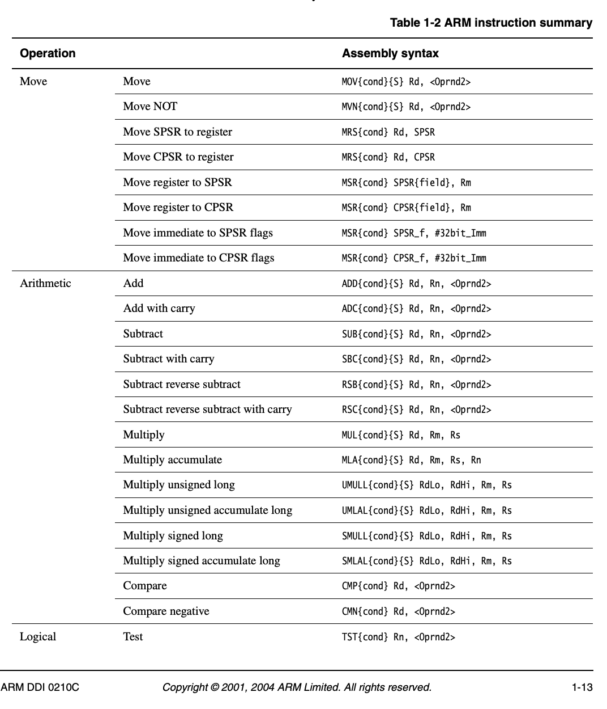
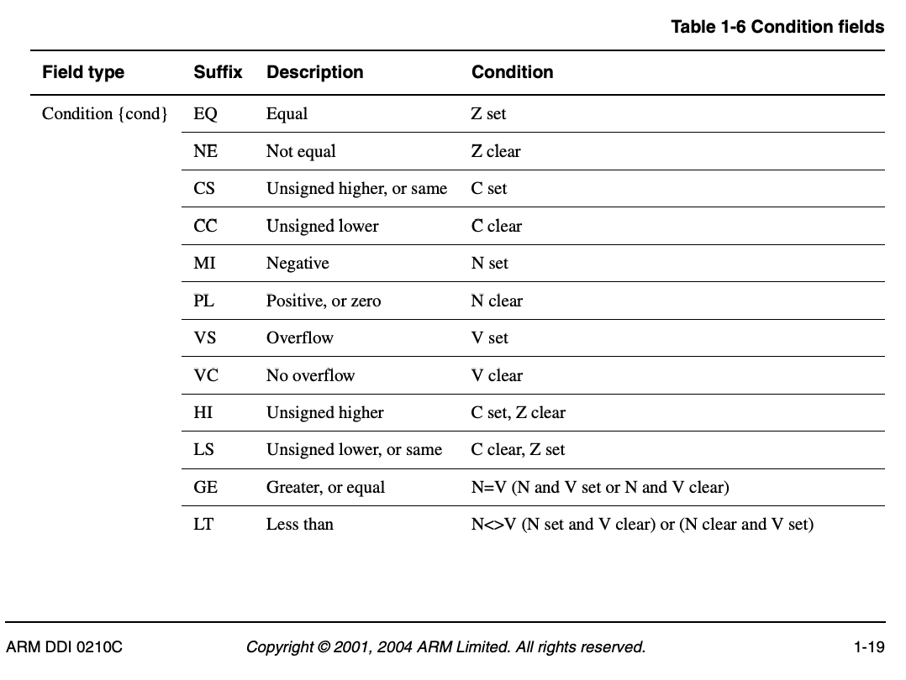

# L9

| Feb 23, 2021 | CSE 2312 | Dr. Losh | UT Arlington | Luke Sweeney |
| ------------ | -------- | -------- | ------------ | ------------ |

# Positive or Negative program
Today we're writing a program that determines if a number is positive or not.

These notes are *very* loosely organized, it's a bit messy here.

----------

Here's some of the assembly commands we've gone over, and some new ones

```s
ADD R0, R0, R1     # R0 <- R0 + R1
SUB R0, R0, R1     # R0 <- R0 - R1
ADDS R0, R0, R1    # R0 <- R0 + R1 and update flags
SUBS R0, R0, R1    # R0 <- R0 - R1 and update flags

CMP R0, R1         # Result is thrown away, this updates flags
```


## `CMP`
We can do something like this

```s
# This means R0 - 0, which seems like it does nothing,
# but all the flags are being updated.
# #0 is called "operand 2", which we'll get to shortly.

# Example, the zero flag ZF = 1 if R0 is zero
CMP R0, #0
```

## Operand 2
You'll see `{Oprnd2}` throughout the manual. There's a number of things that could be (there's a table in the manual). It could be a constant value, or another register, or a bunch of other shit. See page 38 (1-18) of the manual for more details.

## `ADDNE`
```s
# This ADDs if the zero flag = 0 (meaning the number is nonzero)
# R0 <- R1 + R2 if ZF = 0
ADDNE R0, R1, R2
#  ^^ NE is called a "condition code"
# More on condition codes in the section below about the technical manual
```


# Reading the ARMv7 Technical Manual
The ARM instruction summary is on page 33 of the pdf, page number 1-13.

Here's the first page of the instructions (not a complete list)


Take the first arithmetic instruction for example. This performs an "Add", the instruction is called `ADD`, with an optional `{cond}` condition and `{S}` to set flags.


Page 39 shows the conditions



----------

See the code in my [CSE2312 repository](https://github.com/llamicron/CSE2312) for the code for this lecture.
